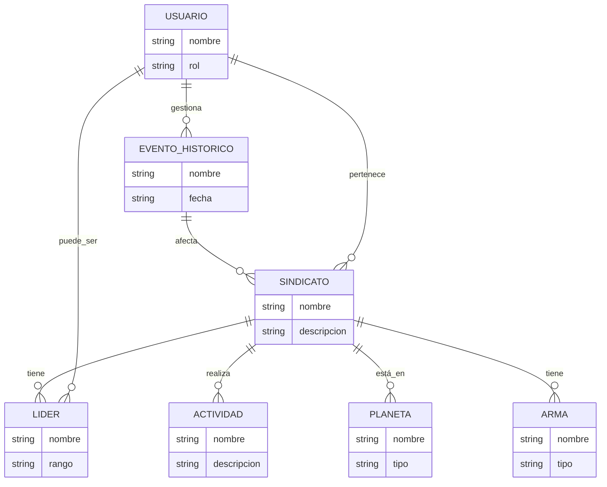
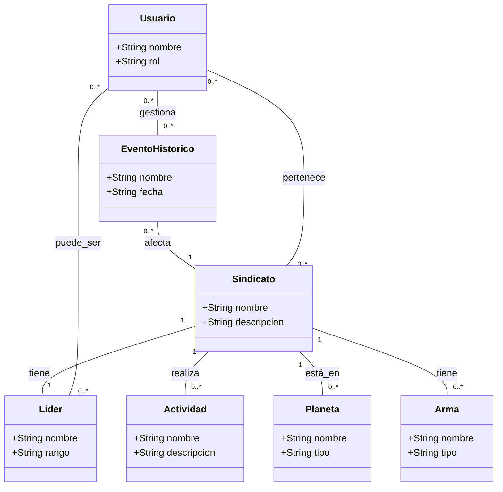

# Documentación del Proyecto: **Gestión de Sindicatos en el Universo Star Wars**

## 1. Introducción

Este proyecto tiene como objetivo desarrollar una aplicación gráfica utilizando **Java** para gestionar la información de los sindicatos en el universo de **Star Wars**. La aplicación permitirá realizar operaciones sobre los datos importados de los sindicatos, tales como la visualización, modificación y eliminación de registros, así como gestionar los miembros y eventos históricos asociados a cada uno.

## 2. Motivación/Justificación de la Idea

La motivación de este proyecto es crear una aplicación que permita gestionar la información relacionada con los sindicatos, como el **Sindicato** de Hutt, **Sindicato Pike**, y otros en el contexto de Star Wars. A través de una interfaz gráfica, los usuarios podrán manejar datos relacionados con armas, líderes, actividades, y eventos históricos de estos sindicatos, facilitando la gestión de sus recursos y miembros.

El objetivo de la aplicación es:

- Gestionar los registros de los sindicatos en una base de datos.
- Mejorar la interacción de los usuarios con los datos relacionados con los sindicatos mediante una interfaz gráfica.
- Ofrecer funcionalidades de consulta y actualización en tiempo real.

## 3. Objetivos Propuestos

### Objetivos Funcionales

- **CRUD** (Crear, Leer, Actualizar, Eliminar) sobre las entidades gestionadas en la base de datos, como **Sindicatos**, **Líderes**, **Actividades** y **Armas**.
- Realizar operaciones históricas relacionadas con los sindicatos, como calcular victorias o pérdidas en actividades.
- Gestionar varios tipos de usuarios con permisos diferenciados para administrar y consultar la información.

### Objetivos No Funcionales

- **Interfaz gráfica atractiva y funcional**, que permita interactuar fácilmente con los datos de los sindicatos.
- **Uso de patrones de diseño y buenas prácticas** en el desarrollo de la aplicación.

## 4. Metodología Utilizada

El proyecto se ha desarrollado bajo el enfoque de **Programación Orientada a Objetos (POO)**, utilizando una **arquitectura de 3 capas**:

1. **Modelo**: Clases que representan las entidades de la base de datos como **Sindicato**, **Arma**, **Líder**, **Planeta** y **Evento Histórico**.
2. **Vista**: Interfaz gráfica del usuario (GUI) construida con **Swing**.
3. **Controlador**: Clases que gestionan la lógica de negocio y la comunicación entre la vista y el modelo.

El acceso a la base de datos se realiza utilizando **DAO (Data Access Objects)** para las entidades como **SindicatoDAO**, **LiderDAO**, y **ActividadDAO**.

## 5. Diagrama de Gant

| Tarea                           | Tiempo Estimado | Tiempo Real |
|----------------------------------|-----------------|-------------|
| Análisis y Diseño                | 1 semana        | 1 semana    |
| Desarrollo de la Base de Datos    | 1 semana        | 1 semana    |
| Desarrollo de la Interfaz Gráfica | 2 semanas       | 2 semanas   |
| Integración y Pruebas            | 1 semana        | 1 semana    |
| Documentación                    | 1 semana        | 1 semana    |

## 6. Tecnologías y Herramientas Utilizadas

- **Lenguaje de programación**: **Java**
- **Base de datos**: **MySQL**
- **Entorno de desarrollo**: **Eclipse**
- **Librerías**: Swing para la interfaz gráfica.

## 7. Análisis

### Requisitos Funcionales

- El sistema debe ser capaz de realizar **consultas, inserciones, actualizaciones y eliminaciones** en la base de datos de los sindicatos.
- Debe soportar **varios tipos de usuarios** con permisos diferenciados (Administrador y Cliente).
- El sistema debe realizar **operaciones históricas**, como el cálculo de victorias y fracasos de los sindicatos.

### Requisitos No Funcionales

- La interfaz gráfica debe ser **intuitiva y fácil de usar**.
- El sistema debe ser **rápido y eficiente** en la interacción con la base de datos.

### Diagrama Entidad-Relación

A continuación, se muestra el diagrama de entidades y relaciones de la base de datos que involucra a los sindicatos, líderes y sus actividades:


### Diagrama de Clases

El diagrama de clases que muestra la relación entre las clases de Java en el proyecto es el siguiente:


### Casos de Uso

- **Login de usuario**: El usuario ingresa al sistema, se valida y se accede a la interfaz correspondiente según su rol (administrador o cliente).
- **Gestión de sindicatos**: El administrador puede agregar, editar o eliminar sindicatos de la base de datos, así como gestionar las actividades y líderes asociados.

## 8. Diseño

### Mock-up


### Resultado Final


## 9. Partes Resaltables del Código

- **Clase ConexionBD.java**: Esta clase gestiona la conexión con la base de datos. Se encarga de abrir y cerrar la conexión, asegurando que las consultas a la base de datos se realicen correctamente.

```java
public class ConexionBD {
    public static Connection getConexion() {
        try {
            Connection con = DriverManager.getConnection(URL, USER, PASSWORD);
            return con;
        } catch (SQLException e) {
            e.printStackTrace();
        }
        return null;
    }
}
```

- **Método en la clase SindicatoDAO.java**: Este método permite insertar un nuevo sindicato en la base de datos.

```java
public boolean insertarSindicato(Sindicato sindicato) {
    String query = "INSERT INTO sindicatos (nombre, lider_id, actividad_id) VALUES (?, ?, ?)";
    try (PreparedStatement pst = con.prepareStatement(query)) {
        pst.setString(1, sindicato.getNombre());
        pst.setInt(2, sindicato.getLiderId());
        pst.setInt(3, sindicato.getActividadId());
        int filasAfectadas = pst.executeUpdate();
        return filasAfectadas > 0;
    } catch (SQLException e) {
        e.printStackTrace();
    }
    return false;
}
```

## 10. Conclusión del Trabajo

Este proyecto ha sido una excelente oportunidad para aplicar los conocimientos adquiridos durante el curso de programación, especialmente en el desarrollo de aplicaciones con **Java** y **MySQL**. A lo largo del desarrollo, hemos aprendido a integrar bases de datos con interfaces gráficas, a utilizar patrones de diseño y a gestionar la comunicación entre diferentes componentes del sistema.

La implementación de la interfaz gráfica ha sido un reto, pero la experiencia ha permitido fortalecer nuestras habilidades en **Swing** y en la organización de aplicaciones basadas en **POO**.

Este proyecto ha sido una parte importante de nuestro aprendizaje, y nos ha permitido poner en práctica todo lo aprendido a lo largo del curso.

---

¡Gracias por tu atención!
